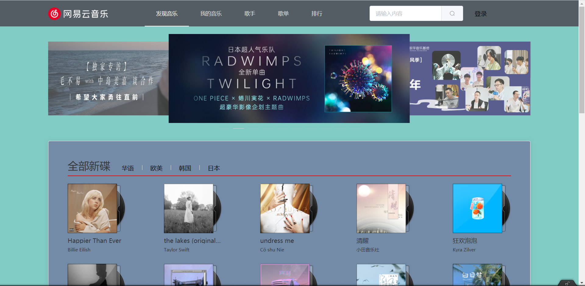
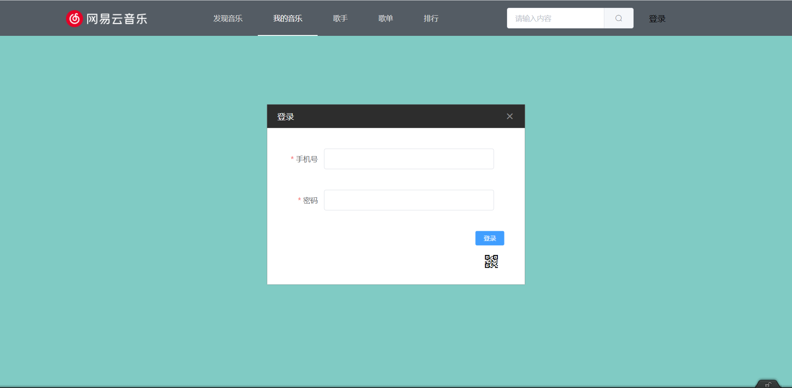
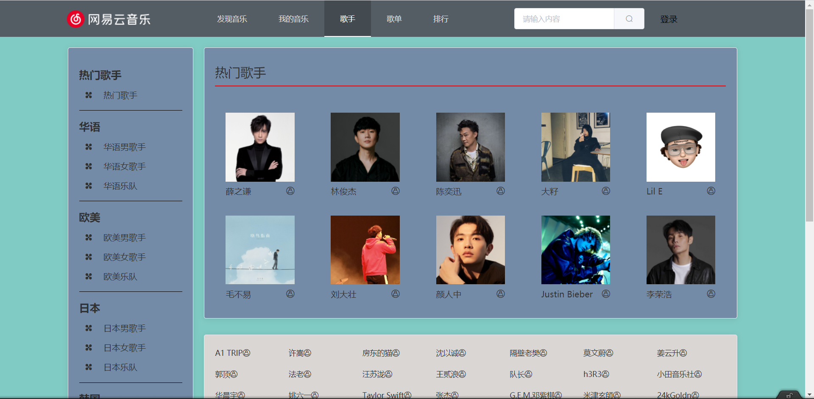
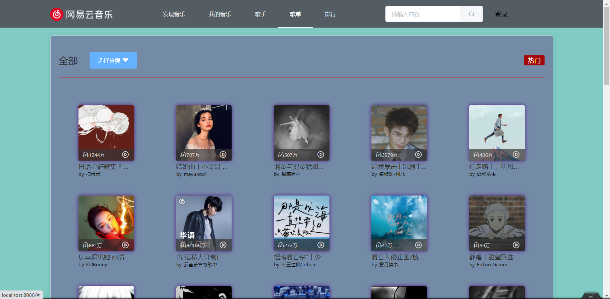
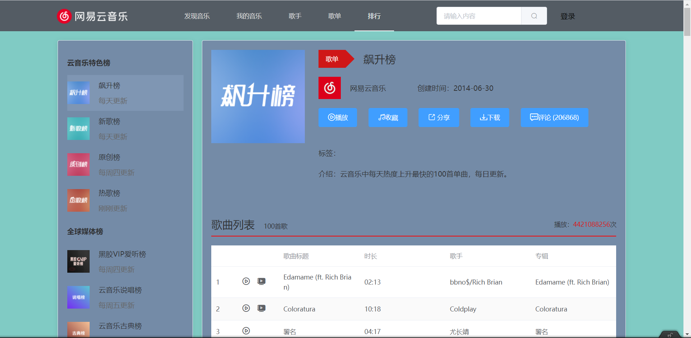
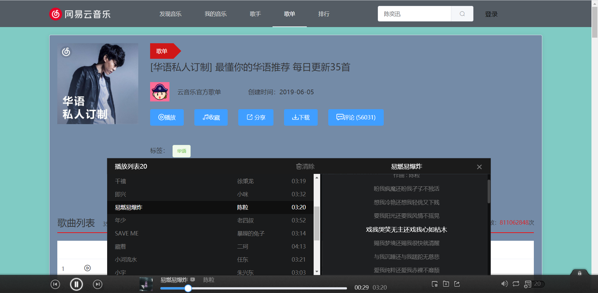

# funs-music

## 本人前端技术完全自学 项目中可能出现不专业的地方   愿以后自己能同大家一起加油 更上一层楼

*****

## 本项目依赖 >>Binaryify(https://github.com/Binaryify) 提供的 >>NeteaseCloudMusicApi(https://github.com/Binaryify/NeteaseCloudMusicApi.git) 网易云音乐接口

## 项目开始前请先启动服务

*****

## 安装依赖
```
npm install
```

### 启动项目
```
npm run serve
```

### Compiles and minifies for production
```
npm run build
```
*****

#### 项目展示

##### 首页


##### 登录


##### 歌手


##### 歌单


##### 排行榜


##### 播放条

